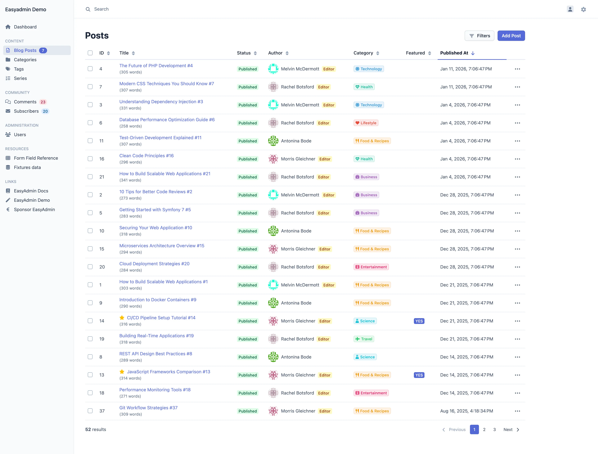

<p align="center"><a href="https://github.com/EasyCorp/EasyAdminBundle">
    
</a></p>

<p align="center">
    <strong>The easiest way to build Symfony admin panels</strong>
</p>

<p align="center">
    <a href="https://packagist.org/packages/easycorp/easyadmin-bundle"></a>
    <a href="https://packagist.org/packages/easycorp/easyadmin-bundle"></a>
    <a href="https://github.com/EasyCorp/EasyAdminBundle/blob/4.x/LICENSE"></a>
    <a href="https://github.com/EasyCorp/EasyAdminBundle/actions"></a>
</p>

<p align="center">
    <a href="https://symfony.com/bundles/EasyAdminBundle/current/index.html">Documentation</a>
     • <a href="https://symfonycasts.com/screencast/easyadminbundle">Video Tutorial</a>
</p>

---

EasyAdmin creates beautiful backends for Symfony applications. It's free, fast, fully documented, and trusted by tens of thousands of projects.

<p align="center">
    <a href="./doc/images/easyadmin-screenshot-index-light.webp" target="_blank">
        <picture>
            <source media="(prefers-color-scheme: dark)" srcset="./doc/images/easyadmin-screenshot-index-dark.webp">
            <source media="(prefers-color-scheme: light)" srcset="./doc/images/easyadmin-screenshot-index-light.webp">
            
        </picture>
    </a>
</p>

## Quick Start

In your Symfony application, run these commands:

```bash
composer require easycorp/easyadmin-bundle
php bin/console make:admin:dashboard
php bin/console make:admin:crud
```

Visit `/admin` in your browser. That's it!

📖 **[Read the full documentation →](https://symfony.com/bundles/EasyAdminBundle/current/index.html)**

## Features

| Feature | Description |
| ------- | ----------- |
| 🎨 **Beautiful by Default** | Modern, responsive UI with light and dark modes. No CSS required |
| 👥 **Multiple Dashboards** | Create separate backends for guests, external collaborators, or different user roles |
| ⚡ **CRUD in Minutes** | Generate complete backends from your Doctrine entities with a single command |
| 🔍 **Search, Filters & Pagination** | Powerful built-in tools to find and navigate your data effortlessly |
| 🛡️ **Fine-grained Security** | Control access at dashboard, menu, action, field, and entity level |
| 🎛️ **30+ Field Types** | Text, dates, associations, file uploads, WYSIWYG and code editors, and much more |
| 📐 **Flexible Form Layouts** | Create sophisticated forms with multiple columns, tabs, and fieldsets |
| ⚙️ **Custom Actions** | Add your own buttons, batch operations, and workflows |
| 🌍 **Fully Translatable** | RTL support included. Translations available in 40+ languages |
| 🛠️ **100% Customizable** | Override any template, extend any class, customize everything |
| 🧩 **Symfony Native** | Seamlessly integrated with Symfony forms, security, routing, and more |
| ✅ **Unmatched Compatibility** | Works with Symfony 5.4, 6.x, 7.x, and 8.x and Doctrine 2.x, 3.x, and 4.x |

## Why EasyAdmin?

- **Trusted by tens of thousands of projects**: One of the most downloaded Symfony bundles ever
- **Battle-tested since 2015**: Mature, stable, and production-ready
- **Maintained by Symfony experts**: 500+ contributors and led by a Symfony Core Team member
- **Zero JavaScript knowledge required**: Build complete backends with PHP only
- **Extensible when you need it**: Customize anything without fighting the framework

## Requirements

- PHP 8.1 or higher
- Symfony 5.4 or higher
- Doctrine ORM entities

### Versions

| Version / Repository Branch | Symfony Compatibility         | PHP Compatibility | Status               | Docs
| --------------------------- | ----------------------------- | ----------------- | -------------------- | ---
| `5.x`                       | `6.4`, `7.x` and `8.x`        | `8.1` or higher   | In development | [Read Docs](https://symfony.com/bundles/EasyAdminBundle/5.x/index.html)
| `4.x`                       | `5.4`, `6.x`, `7.x` and `8.x` | `8.1` or higher   | New features and bug fixes | [Read Docs](https://symfony.com/bundles/EasyAdminBundle/4.x/index.html)
| `3.x`                       | `4.4`, and `5.x`              | `7.2.5` or higher | No longer maintained | [Read Docs](https://symfony.com/bundles/EasyAdminBundle/3.x/index.html)
| `2.x`                       | `4.x`, and `5.x`              | `7.1.3` or higher | No longer maintained | [Read Docs](https://symfony.com/bundles/EasyAdminBundle/2.x/index.html)
| `1.x`                       | `2.x`, `3.x` and `4.x`        | `5.3.0` or higher | No longer maintained | -

### Dev Environment

EasyAdmin ships a DDEV environment, which allows you to run EasyAdmin in a
Symfony Framework project providing example entities and CRUD Controllers.

**Requirements:**

* [Docker](https://www.docker.com/get-started/)
* [DDEV](https://ddev.com/get-started/)

**Using the environment:**

* Checkout the EasyAdmin git repository and switch in the project directory
* Perform `ddev setup` which starts and provisions the web container
* EasyAdmin is available under the URL: https://easy-admin-bundle.ddev.site
* To (re-)build frontend assets perform `ddev build-assets`
* To run unit tests perform `ddev run-tests`

## Resources

- 📖 [Official Documentation](https://symfony.com/bundles/EasyAdminBundle/current/index.html)
- 🎬 [SymfonyCasts Video Tutorial](https://symfonycasts.com/screencast/easyadminbundle)
- 🎮 [EasyAdmin Demo](https://github.com/EasyCorp/easyadmin-demo)
- 🐛 [Issue Tracker](https://github.com/EasyCorp/EasyAdminBundle/issues)

## Contributing

EasyAdmin is an open source project. Contributions are welcome and appreciated!

See [CONTRIBUTING.md](CONTRIBUTING.md) for guidelines.

<p>
  
  EasyAdmin is developed using <a target="_blank" href="https://www.jetbrains.com/phpstorm/">PhpStorm</a>, generously provided by JetBrains through their Open Source License Program.
</p>

## License

EasyAdmin is released under the [MIT License](LICENSE).

---

<p align="center">
    <sub>Created with ❤️ by <a href="https://github.com/javiereguiluz">Javier Eguiluz</a> and <a href="https://github.com/EasyCorp/EasyAdminBundle/graphs/contributors">contributors</a></sub>
</p>
